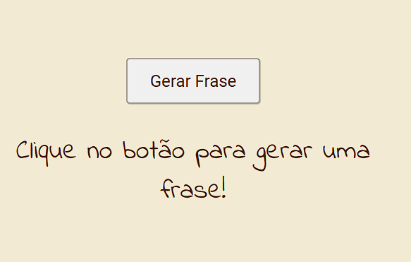

  

## Projeto Gerador de Frases - 💬
Projeto gerador de frases, consiste em clicar no botão e gerar uma frase aleatória. Feito para treinar HTML, CSS e principalmente a linguagem JavaScript.

## Tecnologias - 👨‍💻
- HTML 
- CSS
- JavaScript
- Git e Github 
